  <!-- TOP BANNER (日式幽玄 / 花札・麻将・鬼火 SVG) -->
  

    

  <!-- TECH PILLARS -->
  

    <code>Python</code> &nbsp;•&nbsp;
    <code>Automation</code> &nbsp;•&nbsp;
    <code>Open Source</code>
  

  <!-- INTRO STATEMENT (已移除梦境相关语句，突出开发者技术定位) -->
  

    专注于 <b>Python</b> 核心生态开发、自动化工作流与实用逆向工具探索。
  

   

  <!-- SECTION 1: TECH ARSENAL (以 Python 为核心的黑墨绿徽章) -->
  

    
  

  

    
    
    
    
  

  

    
    
    
    
  

   

  <!-- SECTION 2: MINIMALIST STATS (专注项目数 & Star 数，无综合评级) -->
  

    
  

  <!-- 精选指标卡片（墨绿暗夜定制色） -->
  

    
    
  

  <!-- 动态徽章快速统计 -->
  

    
    &nbsp;
    
    &nbsp;
    
  

   

  <!-- SECTION 3: RANDOM QUOTE (随机哲思格言卡片) -->
  

    
  

  

    
  

   

  <!-- FOOTER SIGN-OFF -->
  

    
      <i>Stay curious, keep building. • 持续探索，用代码构建有趣之物。</i>
    
  

  

    
  

